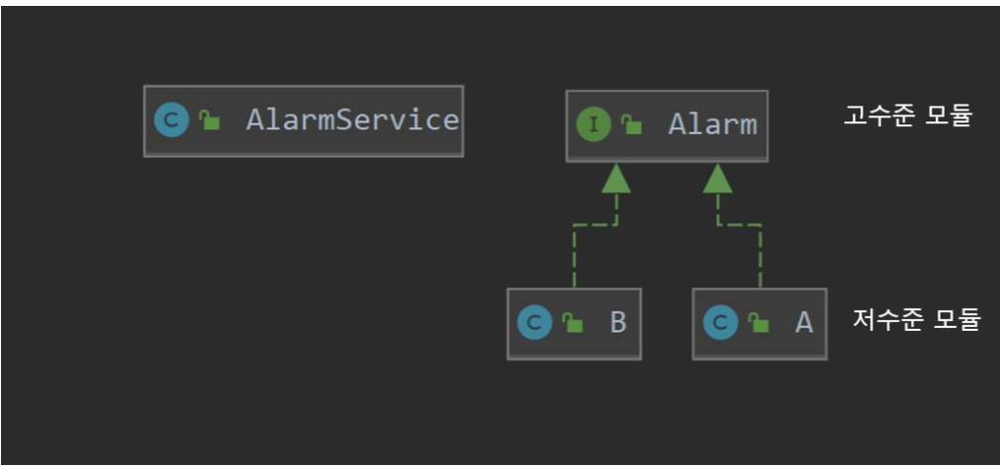

# DIP (Dependency Inversion Principle)
- DIP는 객체지향설계 5원칙(SOLID)에서 D에 해당하는 원칙이며, 아래와 같은 의미를 가지고 있다.

<b style="color: orange"> 저수준 모듈이 고수준 모듈에 의존하게 되는 것.</b>

## 계층 구조 아키텍쳐
- 표현 계층 -> 응용 계층 -> 도메인 계층 -> 인프라 계층
  - 표현 계층 : 사용자의 요청을 받아 응용 영역에 전달함과 동시에 처리 결과를 사용자에게 표시
  - 응용 영역 : 사용자에게 제공해야 할 기능 구현
  - 도메인 영역 : 도메인의 핵심 로직 & 도메인 모델 구현
  - 인프라 계층 : 구현 기술을 다룸 (ex. DB 연동)
    - 각 계층은 위와 같은 특징을 가지고 있으며,  
      - 상위 계층은 하위 계층에게 의존하지만. 
      - 하위 계층은 상위 계층에 의존하지 않는다.
    - 하지만 그렇게 되면 인프라 계층에게 종속적인 현상이 많이 일어나게 된다.
### 기존 코드의 문제
```java
package com.tobySpring.SOLID.DIP;

/**
 * A사의 알람 서비스
 * */
public class A {
  public String beep() {
    return "beep!";
  }
}
```
```java
package com.tobySpring.SOLID.DIP;


/**
 * 서비스 코드
 */
public class AlarmService {
    
    private A alaram;

    public String beep () {
        return alaram.beep();
    }
}
```
#### 위 코드에는 두 가지 문제가 있다.

1. 테스트의 어려움
- 위 코드에서 `AlaramService`만 온전히 테스트할 수 없다.
  - 인프라 계층에 속하는 A가 완벽하게 동작해야만 `AlaramService`를 테스트할 수 있다.
2. 확장 및 변경이 어려움
- 만약 알람 서비스에 B사가 추가된다면 어떻게 될까요? 아래와 같이 서비스 코드를 변경해야한다.
```java
package com.tobySpring.SOLID.DIP;
/**
 * B사의 알림 서비스
 * */
public class B {
    public String beep(){
        return "beep";
    }
}
```
```java
package com.tobySpring.SOLID.DIP;

/**
 * 서비스 코드
 */
public class AlarmService {
    
    private A alaramA;
    private B alaramB;

    public String beep (String company) {
        if (company.equals("A")){
            return alaramA.beep();
        }else {
        return alaramB.beep();
        }
    }
}
```
- 만약 여기서 C의 알림서비스가 추가된다면 또 서비스 코드를 바꿔야 한다.  
C사의 알림 서비스 메서드를 추가하거나, if문을 사용해서 B사의 알림 서비스를 사용할지, C사의 알림 서비스를 사용할지 정해야 한다.  
이런식으로 인프라 계층이 바뀌거나 추가될 때 마다 서비스 코드를 바꾸는 것은 좋은 코드가 아니다.

- 여기서 DIP를 적용하면 위 문제를 해결할 수 있다.

### DIP
- 방금 설명한 기능을 고수준 모듈과 저수준 모듀롤 분리하면 아래와 같다.
  - 고수준 모듈 : 알림
  - 저수준 모듈 : A사의 알림 서비스, B사의 알림 서비스
- 지금까지 사용한 방법은 **고수준 모듈이 저수준 모듈에 의존** 하는 방법이지만, DIP 를 적용하게 되면 **저수준 모듈이 고수준 모듈에 의존** 해야 한다.  
그러기 위해서 사용한느 것이 추상 타입(ex. 인터페이스 , 추상 클래스)이다.
```java
package com.tobySpring.SOLID.DIP;

public interface Alarm {
    String beep();
}
```
- 저수준 모듈이 상속 받을 `Alarm` 인터페이스를 만들어준다.
```java
package com.tobySpring.SOLID.DIP;

/**
* A사의 알람 서비스
* */
public class A implements Alarm{

    @Override
    public String beep() {
        return "Beep!";
    }
}
```
```java
package com.tobySpring.SOLID.DIP;
/**
 * B사의 알림 서비스
 * */
public class B implements Alarm{
  @Override
  public String beep(){
    return "beep";
  }
}
```
- 그 후에 저수준 모듈들이 `Alarm`을 구현하면 된다. 그렇게 되면 서비스 코드를 다음과 같이 변경이 가능하다.
```java
package com.tobySpring.SOLID.DIP;


/**
 * 서비스 코드
 */
public class AlarmService {

    private Alarm alarm;

    public AlarmService(Alarm alarm) {
        this.alarm = alarm;
    }

    public String beep() {
        return alarm.beep();
    }
}
```
- 더 이상 `AlarmService`는 알람 서비스가 추가된다고 코드를 변경하거나 추가해야 하는 일이 없어진다.
- 또한, 알람 관련 객체는 무조건 인터페이스인 `Alarm`에 의존하기 때문에 `Alarm`을 `Mock` 객체로 만들어 다양한 시나리오로 `AlarmService`기능을 온전히 테스트할 수 있다는 장점도 가져갈 수 있다.

- 코드를 클래스 다이어그램으로 나타내면 위와 같다.
  - 저수준 모듈이 고수준 모듈에 의존하게 된느 것을 DIP (의존관계 역전 원칙)이라고 한다.

#