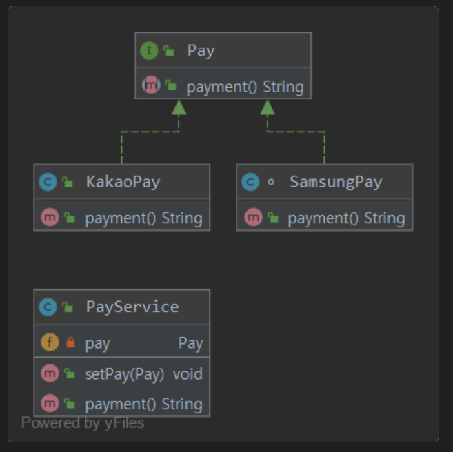

## DIP ?
### DIP의 정의
- 상위 모듈은 하위 모듈에 의존해서는 안된다.
- 추상화는 세부 사항에 의존해서는 안된다.
  - 의존 관계를 맺을 때 변화하기 쉬운 것에 의존하기 보다는, 변화하지 않는 것에 의존하라는 원칙.
    - 예시
      - `PayService`를 개발하고 싶은 상황에서 `Pay`라는 수단은 여러가지 방법이 있다. (SamsungPay, KaKaoPay, NaverPay 등등)
      - 이 중에서 하나 골라서 Service를 제공한다고 가정했는데, 요구사항에 의해서 다른 Pay수단들도 추가해달라고 한다.  
      초기 설계에 딱 하나의 Pay 수단만 가지고 메서드를 구현했다면 확자엥 어려운 설계가 되버린다.
      - 이러한 상황에 <b style="color: orange"> 확장하기 편하게 공통부분을 묶어서 변화하지 않게 설정해야 한다.</b>
    - 잘못된 예시
      - 삼성페이를 선택했다고 가정.      
```java
package com.tobySpring.SOLID.DIP2;

public class SamsungPay {
    String payment(){
        return "samsung";
    }
}
```
```java
package com.tobySpring.SOLID.DIP2;

public class PayService {
  private SamsungPay pay;

  public void setPay(final SamsungPay pay) {
    this.pay = pay;
  }

  public String payment(){
    return pay.payment();
  }
}
```
  - 위와 같이 간단하게 구현할 수 있지만,  
  요구사항이 변경되어 다른 `PayService`를 만들어야 한다고 하면 메서드를 하나씩 추가해야하는 문제가 생긴다.
  - 위를 리팩토링을 하게 되면.
```java
package com.tobySpring.SOLID.DIP2;

public class SamsungPay implements Pay{
    @Override
    public String payment(){
        return "samsung";
    }
}
```
```java
package com.tobySpring.SOLID.DIP2;
// 다른 pay 방법도 추가
public class KakaoPay implements Pay{
    @Override
    public String payment() {
        return "kakao";
    }
}
```
```java
package com.tobySpring.SOLID.DIP2;

public class PayService {
    private Pay pay;

    public void setPay(final Pay pay) {
        this.pay = pay;
    }

    public String payment(){
        return pay.payment();
    }

}
```
와 같이 되어 어떤 Pay방법이 와도 가능하다.

```java
package com.tobySpring.SOLID.DIP2;

import org.junit.Assert;
import org.junit.jupiter.api.Test;

import static org.junit.Assert.assertThat;

class PayServiceTest {
    private PayService payService = new PayService();

    @Test
    void samsungPay_Test(){
        /* Given*/
        Pay samsungPay = new SamsungPay();
        /* When */
        payService.setPay(samsungPay);
        /* Then */
        Assert.assertEquals(payService.payment(),"samsung");
    }

    @Test
    void kakao_Test(){
        /* Given*/
        Pay kakaoPay = new KakaoPay();
        /* When */
        payService.setPay(kakaoPay);
        /* Then */
        Assert.assertEquals(payService.payment(),"kakao");
    }
}
```


- DIP가 중요한 이유는 확장성이 용이하다.
- 객체간의 관계를 최대한 느슨하게 해주는 효과가 있다.
  - 다양한 설계 방식, 복잡한 시스템 설꼐가 가능하게 된다.
```
객체 지향 프로그래밍에서 의존관계 역전 원칙은 소프트웨어 모듈들을 분리하는 특정 형식을 지칭한다. 이 원칙을 따르면, 상위 계층(정책 결정)이 하위 계층(세부 사항)에 의존하는 전통적인 의존관계를 반전(역전)시킴으로써 상위 계층이 하위 계층의 구현으로부터 독립되게 할 수 있다. 이 원칙은 다음과 같은 내용을 담고 있다.[1]

첫째, 상위 모듈은 하위 모듈에 의존해서는 안된다. 상위 모듈과 하위 모듈 모두 추상화에 의존해야 한다.
둘째, 추상화는 세부 사항에 의존해서는 안된다. 세부사항이 추상화에 의존해야 한다.
이 원칙은 '상위와 하위 객체 모두가 동일한 추상화에 의존해야 한다'는 객체 지향적 설계의 대원칙을 제공한다.[2]
```

